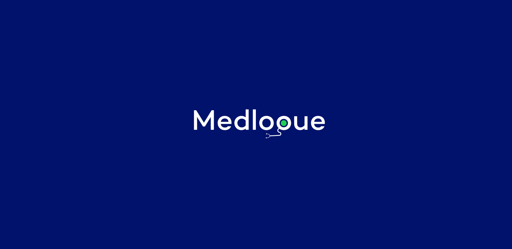

# Medlogue - Online Medical Consultation App

Welcome to the Medlogue project! This repository contains the frontend code for our Online Medical Consultation, your can check [here](https://github.com/samuel-874/medlogue-backend) for the backend. Medlogue aims to provide a seamless and user-friendly platform for users to access medical consultations online.

## Getting Started

### Prerequisites
- Node.js and npm installed on your machine.

### Installation
1. Clone the repository:
   ```bash
   git clone https://github.com/samuel-874/medlogue.git
   ```
2. Navigate to the project directory:
   ```bash
   cd Medlogue
   ```
3. Install dependencies:
   ```bash
   npm install
   ```

### Running the App
Start the development server:
```bash
npm start
```

Open your browser and visit [http://localhost:3000](http://localhost:3000) to preview the app locally.

## Project Structure
- **src**: Contains the source code of the frontend application.
- **public**: Static assets and the HTML template.

## Preview


## Features
- **User Authentication**: Secure user registration and login.
- **Appointment Scheduling**: Easily schedule and manage medical consultations.
- **Real-time Communication**: Seamless video consultations and chat messaging.
- **User-friendly Interface**: Intuitive design for a positive user experience.


## Issues
If you encounter any issues or have suggestions, please [open an issue](https://github.com/your-username/Medlogue/issues).


